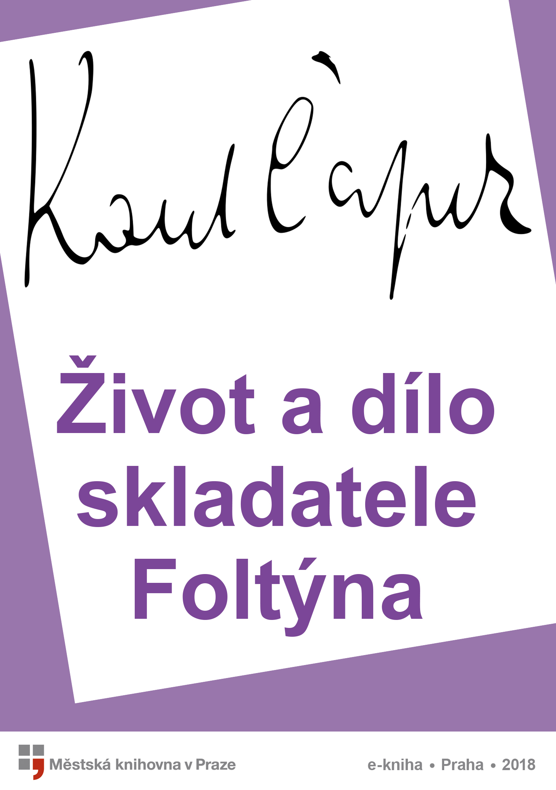

<section>

</section>

[^1]: Salup (franc.) – velký šátek. _Pozn. red._

[^2]: Boióťané, Fajákové – podle Homérovy _Odyssey_ obyvatelé bájných krajin, jimiž Řekové pohrdali. _Pozn. red._

[^3]: Šalabastr (maď.) – tahák. _Pozn. red._

[^4]: Misera plebs (lat.) – chudina, nevzdělaný lid. _Pozn. red._

[^5]: Myrmidoni – bájný starořecký kmen, který odvozoval svůj původ od mravenců, přeneseně je Myrmidon člověk, který slepě vykonává příkazy. _Pozn. red._

[^6]: Ad audiendum verbum (lat.) – k výslechu. _Pozn. red._

[^7]: Jan Malát, čes. hudební skladatel a pedagog (1843–1915), mj. autor metodiky hry na klavír a housle. _Pozn. red._

[^8]: Sufizantní (fr.) – samolibý, ješitný. _Pozn. red._

[^9]: Infinitezimální (lat.) – nekonečně malý. _Pozn. red._

[^10]: Frenezie (řec.) – bouřlivé nadšení. _Pozn. red._

[^11]: Zapsáno podle ústního sdělení.

[^12]: Středověký nominalismus – filozofický směr, který tvrdí, že obecným pojmům nic skutečného neodpovídá, jsou to jen výtvory lidského myšlení, pouhá jména (z lat. nomen = jméno). _Pozn. red._

[^13]: Dopisy Abaelarda a Heloisy – dopisy mapující milostný příběh významného filozofa středověku Pierra Abélarda a jeho žačky Heloisy._Pozn. red._

[^14]: Sans-façon …, pas de chichi (fr.) – nenuceně, bez upejpání. _Pozn. red._

[^15]: Gesamtkunstwerk (něm.) – dílo, v němž je spojeno současně více druhů umění (např. hudba, tanec, poezie, architektura…), zde v ironickém slova smyslu dílo, které tvořilo více lidí. _Pozn. red._

[^16]: Marie Brizard – druh likéru. _Pozn. red._

[^17]: Kniks (něm.) – pukrle. _Pozn. red._

[^18]: Mittenwaldky – housle vyrobené v bavorském Mittenwaldu. _Pozn. red._

[^19]: Ostinato (ital.) – opakování tématu v jednom hlasu. _Pozn. red._

[^20]: Fandango – tradiční španělský tanec. _Pozn. red._

[^21]: Cantus firmus (lat.) – zde chorál. _Pozn. red._

[^22]: Rosenkavalier – opera Richarda Strausse (Růžový kavalír). _Pozn. red._

[^23]: Apokryfy (řec.) – spisy, které církev nepojímá do kánonu biblických textů; podvržené, nepůvodní dílo. _Pozn. red._
